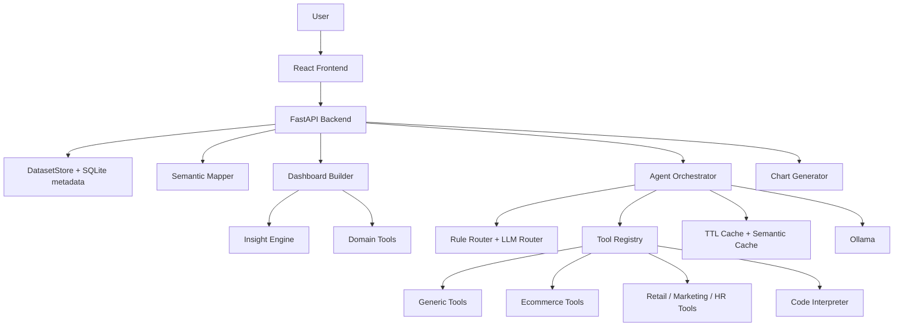

# AI Data Analyst Agent

AI Data Analyst Agent is a **production-style technical MVP** for uploading tabular datasets, generating domain-aware dashboards, and asking natural-language questions through a hybrid deterministic + LLM analytics layer.

It is strong enough for portfolio/demo/internal experimentation, but it is **not yet production-ready**. See [Production Readiness Roadmap](docs/15_production_readiness_roadmap_vi.md) for the remaining work.

## Current Status

| Area | Status |
|---|---|
| Backend API | FastAPI app with upload, profiling, dashboard, chart, ecommerce, semantic profile, and AI chat endpoints |
| Frontend | Vite React TypeScript dashboard with upload, overview, quality, smart dashboard, ecommerce, charts, Ask AI, report |
| Data formats | CSV, XLS, XLSX |
| Storage | Uploaded files saved as CSV in `data/uploads`; metadata stored with SQLite/SQLAlchemy |
| AI layer | Ollama provider, rule-based routing, LLM routing, deterministic fallback, multi-step tool orchestration |
| Dashboard | Backend-driven dashboard contract v2 with KPI cards, insight cards, charts, tables, warnings |
| Semantic layer | Domain detection, role mapping, role candidates, confidence, user override |
| Cache | In-memory TTL cache plus local semantic cache table for repeated questions |
| Security | API key option, upload size limit, restricted CORS config, sandboxed code interpreter prototype |
| Production readiness | Technical MVP, not full production SaaS yet |

## Key Features

- Upload CSV/XLS/XLSX datasets.
- Profile datasets and inspect missing values, duplicates, column types, and summaries.
- Detect dataset domain:
  - ecommerce
  - retail
  - marketing
  - HR
  - finance/generic fallback
- Map columns to semantic roles such as revenue, profit, date, category, quantity, target, campaign, department.
- Override semantic mapping from the React dashboard.
- Generate backend-driven dashboards with:
  - KPI cards
  - insight cards
  - Plotly charts
  - tables
  - warnings
- Run ecommerce-specific analytics:
  - revenue by category/month/state/city/SKU/size
  - cancellation risk
  - fulfilment/courier/promotion/B2B summaries
- Run deeper domain analytics:
  - retail margin/loss/discount/opportunity analysis
  - marketing response/campaign/RFM/channel analysis
  - HR attrition/income/tenure/high-risk segment analysis
- Ask questions through AI Copilot:
  - deterministic Pandas tools as source of truth
  - Ollama explanation when available
  - deterministic fallback when Ollama is unavailable
  - Server-Sent Events progress stream
  - multi-step tool plans for richer questions
- Optional sandboxed Python/Pandas code execution for complex calculations.

## Architecture



## Project Structure

```text
.
├── app/
│   ├── main.py                         # FastAPI app and endpoints
│   ├── config.py                       # Pydantic settings
│   ├── database.py                     # SQLAlchemy models/session
│   ├── schemas/models.py               # Request/response schemas
│   ├── services/
│   │   ├── agent_orchestrator.py       # AI Copilot orchestration
│   │   ├── cache_manager.py            # In-memory TTL cache
│   │   ├── semantic_cache.py           # Local semantic cache via embeddings
│   │   ├── semantic_mapper.py          # Domain and role detection
│   │   ├── dashboard_builder.py        # Dashboard contract v2
│   │   ├── dashboard_insight_engine.py # Insight card helpers
│   │   ├── code_interpreter.py         # Sandboxed Pandas execution
│   │   ├── data_loader.py              # CSV/XLS/XLSX loader
│   │   └── storage.py                  # Dataset file + metadata access
│   └── tools/
│       ├── ecommerce_tools.py
│       ├── generic_analysis_tools.py
│       └── domain_analysis_tools.py
├── web/
│   └── src/
│       ├── App.tsx
│       ├── api.ts
│       └── types.ts
├── frontend/                           # Streamlit fallback/demo UI
├── tests/
├── docs/
├── data/
│   ├── raw/                            # Local raw datasets
│   ├── sample/
│   └── uploads/                        # Uploaded dataset files
├── requirements.txt
├── docker-compose.yml
└── .env.example
```

## Quick Start

### 1. Backend

```bash
conda create -n analyst python=3.11
conda activate analyst
pip install -r requirements.txt
uvicorn app.main:app --reload
```

Backend:

```text
http://127.0.0.1:8000
```

Health check:

```bash
curl http://127.0.0.1:8000/health
```

### 2. React Frontend

```bash
cd web
npm install
npm run dev
```

Frontend:

```text
http://127.0.0.1:5173
```

### 3. Optional Ollama

The app still works without Ollama through deterministic fallback, but Ask AI is better with local models.

```bash
ollama serve
ollama pull qwen2.5:3b
ollama pull qwen2.5:7b
```

Recommended environment:

```bash
cp .env.example .env
```

## Docker Compose

```bash
docker compose up --build
```

Services:

- Backend: `http://localhost:8000`
- React frontend: `http://localhost:5173`
- Streamlit fallback: `http://localhost:8501`

## Environment Variables

Main variables from `.env.example`:

| Variable | Purpose |
|---|---|
| `ALLOWED_ORIGINS` | Comma-separated frontend origins |
| `MAX_UPLOAD_BYTES` | Maximum upload size |
| `OLLAMA_BASE_URL` | Ollama server URL |
| `OLLAMA_MODEL` | Main explanation model |
| `OLLAMA_ROUTER_MODEL` | Smaller router model |
| `OLLAMA_ROUTER_TIMEOUT` | Router timeout |
| `OLLAMA_EXPLAIN_TIMEOUT` | Explanation timeout |
| `CODE_INTERPRETER_TIMEOUT` | Python sandbox timeout |
| `DATABASE_URL` | SQLAlchemy database URL |
| `API_KEY` | Optional API key for simple request protection |
| `LOG_LEVEL` | Logging level |

If `API_KEY` is set, requests must include:

```text
X-API-Key: your-api-key
```

## API Highlights

| Endpoint | Purpose |
|---|---|
| `POST /upload` | Upload CSV/XLS/XLSX |
| `GET /datasets` | List uploaded datasets |
| `GET /summary/{dataset_id}` | Dataset profile |
| `GET /semantic-profile/{dataset_id}` | Semantic profile and role candidates |
| `PUT /semantic-profile/{dataset_id}/overrides` | Save semantic mapping overrides |
| `DELETE /semantic-profile/{dataset_id}/overrides` | Reset semantic overrides |
| `GET /dashboard/{dataset_id}` | Backend-driven dashboard |
| `POST /chart` | Generate Plotly chart JSON |
| `POST /agent/chat` | Ask AI Copilot |
| `POST /agent/chat/stream` | Ask AI with SSE progress |
| `GET /agent/status` | Ollama/agent status |
| `GET /ecommerce/...` | Ecommerce-specific analysis endpoints |

## Example Questions

```text
SKU nào có doanh thu cao nhất?
Category nào có cancel rate cao nhất?
State nào revenue cao nhưng cancellation risk cũng cao?
Segment nào margin thấp dù sales cao?
Campaign nào response tốt nhất?
Nhóm nhân viên nào attrition risk cao?
Cột nào thiếu dữ liệu nhiều nhất?
Vẽ biểu đồ doanh thu theo category
```

## Testing

Run backend tests:

```bash
PYTHONPATH=. pytest -q
```

Or with the conda env Python:

```bash
/home/ductien/miniconda3/envs/reis/bin/python -m pytest -q
```

Run frontend build:

```bash
cd web
npm run build
```

## Important Limitations

This project is not production-ready yet.

Current limitations:

- API key is not a full auth/authorization system.
- No multi-user workspace isolation yet.
- SQLite metadata is useful for local MVP, but production should use migrations and likely PostgreSQL.
- File storage is still local.
- Code interpreter needs stronger container isolation before exposing to untrusted users.
- AI Copilot needs a formal evaluation suite.
- No full audit trail yet.
- No production monitoring/metrics dashboard yet.
- Frontend is still a single large app file and should be modularized.
- Plotly bundle is large and should be lazy-loaded/code-split.

See the detailed plan:

- [Production Readiness Roadmap](docs/15_production_readiness_roadmap_vi.md)

## Documentation

Key docs:

- [Project Overview VI](docs/00_project_overview_vi.md)
- [Architecture](docs/architecture.md)
- [Phase A Copilot Stability](docs/12_phase_a_copilot_stability_acceptance_vi.md)
- [Phase B/C Semantic Dashboard](docs/13_phase_b_c_semantic_dashboard_acceptance_vi.md)
- [Phase D Fast Copilot + Deep Analytics](docs/14_phase_d_fast_copilot_deep_analytics_acceptance_vi.md)
- [Production Readiness Roadmap](docs/15_production_readiness_roadmap_vi.md)

## Recommended Next Work

The next serious sprint should focus on:

1. AI evaluation suite.
2. Agent run logging.
3. Workspace/user model.
4. Alembic migrations.
5. Stronger code interpreter sandbox.
6. Dashboard/report persistence.
7. CI/CD and production Docker setup.

This is the path from **technical MVP** to **production beta**.
