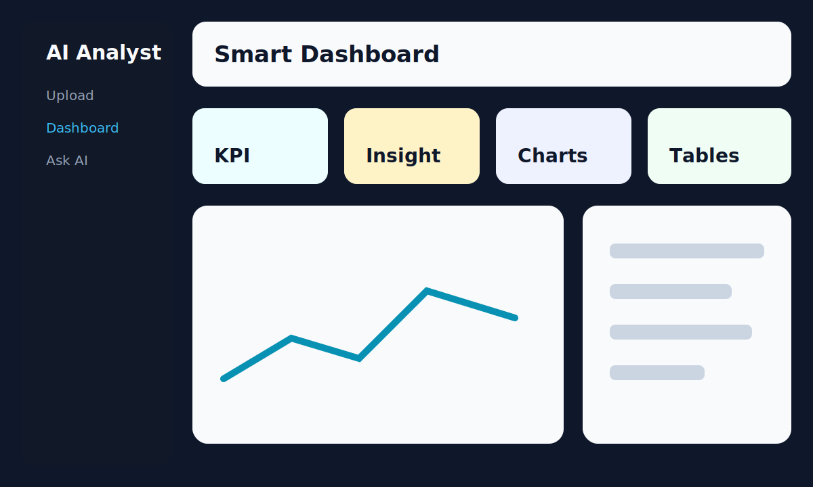
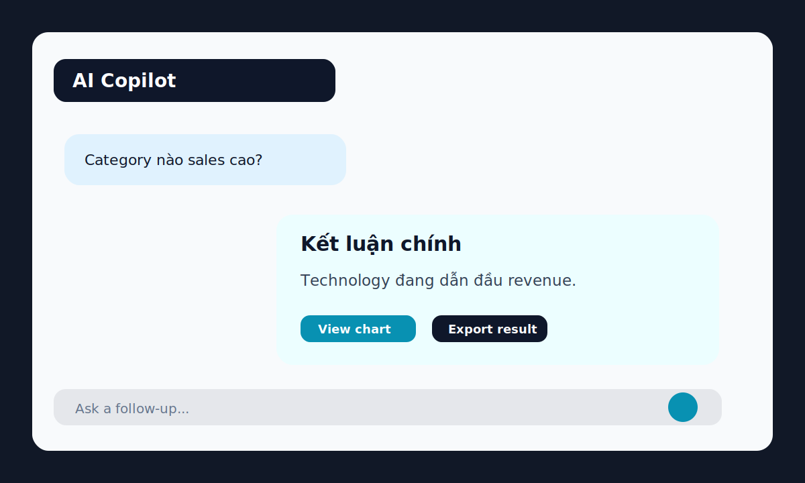
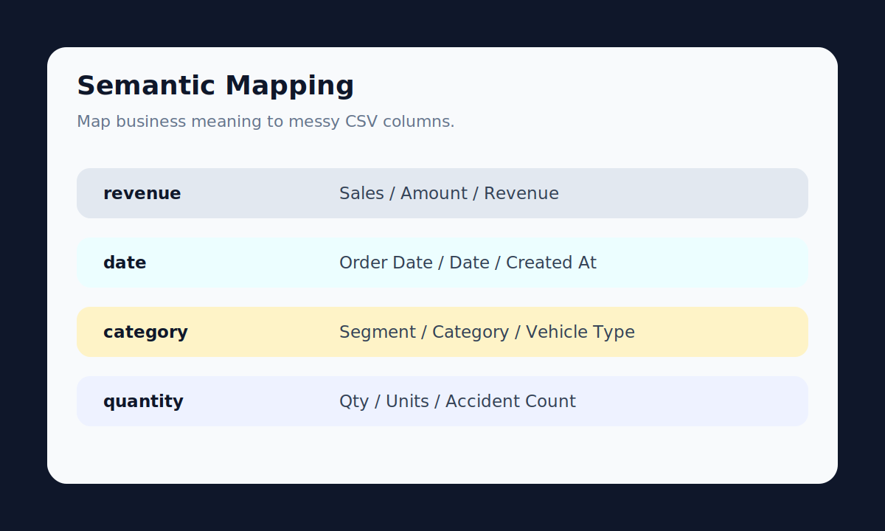
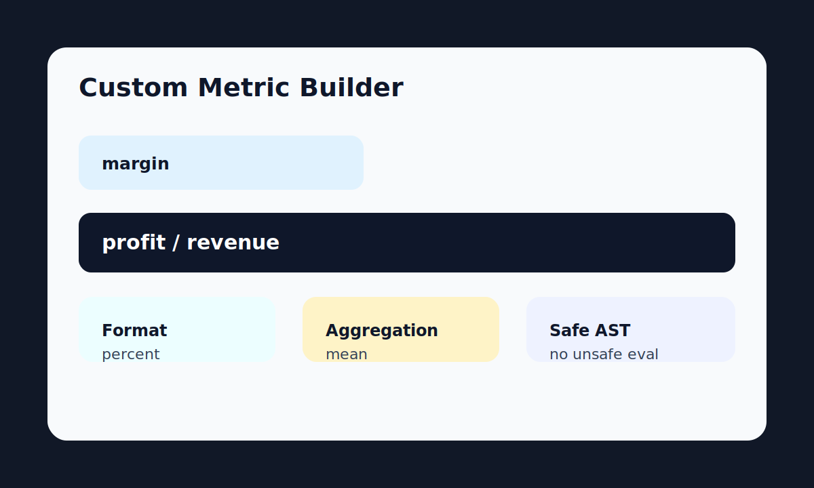
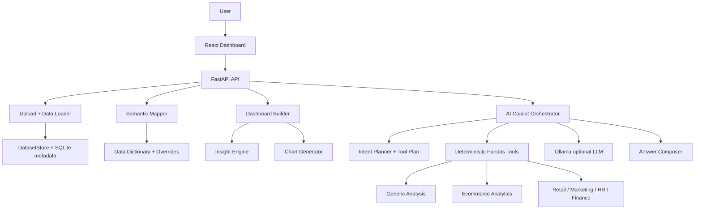

# AI Data Analyst Agent

AI Data Analyst Agent is a full-stack analytics system that turns CSV/XLS/XLSX files into semantic dashboards, validated insights, charts, and AI-assisted business answers.

Unlike a simple chatbot over data, this project grounds answers in deterministic Pandas tools. The LLM is used for routing and explanation, while numbers come from validated backend tools.

> Status: production-style technical MVP for portfolio/demo/internal experimentation. It is not a production SaaS yet.

## Preview

Add or replace these images with live screenshots from your machine:

| Smart Dashboard | AI Copilot |
|---|---|
|  |  |

| Semantic Mapping | Metric Builder |
|---|---|
|  |  |

## What It Does

- Upload CSV, XLS, and XLSX datasets.
- Profile missing values, duplicates, column types, and data quality warnings.
- Detect dataset domains such as ecommerce, retail, marketing, HR, finance, logistics, education, survey, product, and generic tabular data.
- Map columns to semantic roles such as revenue, profit, date, category, quantity, city, campaign, department, salary, target, and conversion.
- Let users upload/edit a data dictionary and override semantic mappings.
- Define custom metrics such as `margin = profit / revenue`.
- Build backend-driven dashboards with KPI cards, insight cards, Plotly charts, tables, warnings, and recommended next questions.
- Ask questions through an AI Copilot with tool calling, deterministic fallback, result cards, timeline, quick actions, and optional Ollama explanations.
- Run an evaluation suite across multi-domain datasets to measure semantic mapping, intent parsing, tool selection, numeric correctness, and latency.

## Tech Stack

| Layer | Stack |
|---|---|
| Backend | FastAPI, Pydantic, Pandas, NumPy, SQLAlchemy |
| Frontend | Vite, React, TypeScript, Tailwind CSS, Plotly |
| AI/LLM | Ollama local models, rule router, JSON tool planning, deterministic fallback |
| Analytics | Semantic mapper, generic tools, ecommerce tools, retail/marketing/HR tools, custom metric engine |
| Storage | Local uploaded files, SQLite metadata |
| Testing/Eval | Pytest, service-layer eval runner, markdown/json eval reports |

## Architecture



## Project Structure

```text
app/                 FastAPI backend, services, schemas, analytics tools
web/                 Vite React TypeScript dashboard
frontend/            Streamlit fallback/demo UI
tests/               Backend and service unit tests
evals/               Multi-domain evaluation suite
docs/                Architecture, phase plans, acceptance docs, demo guide
data/sample/         Small sample dataset committed to repo
data/raw/            Local raw datasets, ignored by git
data/uploads/        Runtime uploads, ignored by git
```

## Quickstart

### 1. Backend

```bash
cd ai-data-analyst-agent-starter
python -m venv .venv
source .venv/bin/activate
pip install -r requirements.txt
cp .env.example .env
make backend
```

Backend runs at:

```text
http://127.0.0.1:8000
```

Health check:

```bash
curl http://127.0.0.1:8000/health
```

### 2. React Frontend

```bash
cd web
npm install
npm run dev
```

Frontend runs at:

```text
http://127.0.0.1:5173
```

You can also run from the project root:

```bash
make frontend
```

### 3. Optional Ollama

The app works without Ollama through deterministic fallback. For AI explanations:

```bash
ollama serve
ollama pull qwen2.5:3b
ollama pull qwen2.5:7b
```

Suggested `.env` values:

```env
OLLAMA_BASE_URL=http://localhost:11434
OLLAMA_ROUTER_MODEL=qwen2.5:3b
OLLAMA_MODEL=qwen2.5:7b
OLLAMA_ROUTER_TIMEOUT=4
OLLAMA_EXPLAIN_TIMEOUT=8
```

## Five-Minute Demo Flow

See the full guide: [docs/demo_guide.md](docs/demo_guide.md).

1. Start backend and frontend.
2. Upload Amazon Sales or Superstore.
3. Open Smart Dashboard and confirm domain detection.
4. Inspect semantic mapping and data quality.
5. Create a custom metric, for example `margin = profit / revenue`.
6. Ask AI Copilot: `Category nào sales cao nhưng profit thấp?`
7. Show tool result, answer card, timeline, and eval report.

## Dataset Setup

Only small sample data is committed. Large/raw datasets are intentionally ignored.

Use:

```text
data/raw/
```

for local datasets such as:

- `Amazon Sale Report.csv`
- `sample_-_superstore.xls`
- `HR-Employee-Attrition.csv`
- `Marketing+Data/marketing_data.csv`
- `online_retail_09_10.csv`

See [data/raw/README.md](data/raw/README.md) and [evals/datasets/README.md](evals/datasets/README.md).

## Evaluation Suite

The eval suite checks whether the system can analyze many CSV/XLS/XLSX files across domains.

Run:

```bash
make eval
```

Strict mode:

```bash
PYTHONPATH=. python evals/run_eval.py \
  --manifest evals/manifest.json \
  --questions evals/questions \
  --out evals/reports/latest.md \
  --mode fast \
  --strict
```

Measured metrics include:

- domain detection accuracy
- semantic role mapping accuracy
- intent parsing accuracy
- tool selection accuracy
- numeric correctness
- answer constraint pass rate
- fallback rate
- average and p95 latency
- cache hit rate
- error rate

## Useful Commands

```bash
make backend      # FastAPI on 127.0.0.1:8000
make frontend     # Vite React on 127.0.0.1:5173
make test         # backend test suite
make build-web    # TypeScript + Vite production build
make eval         # service-layer evaluation suite
```

## API Highlights

| Endpoint | Purpose |
|---|---|
| `POST /upload` | Upload CSV/XLS/XLSX dataset |
| `GET /datasets` | List uploaded datasets |
| `GET /summary/{dataset_id}` | Dataset profile |
| `GET /semantic-profile/{dataset_id}` | Semantic roles, candidates, confidence |
| `PUT /semantic-profile/{dataset_id}/overrides` | Save semantic mapping overrides |
| `GET /dashboard/{dataset_id}` | Backend-driven dashboard contract |
| `POST /chart` | Generate Plotly chart JSON |
| `POST /agent/chat` | Ask AI Copilot |
| `POST /agent/chat/stream` | Ask AI Copilot with progress events |
| `GET /agent/status` | Ollama and agent status |
| `GET /ecommerce/...` | Ecommerce-specific analytics endpoints |

## Example Questions

```text
SKU nào có doanh thu cao nhất?
Category nào có cancellation risk cao nhất?
State nào revenue cao nhưng cancellation risk cũng cao?
Segment nào margin thấp dù sales cao?
Campaign nào response tốt nhất?
Nhóm nhân viên nào attrition risk cao?
Cột nào thiếu dữ liệu nhiều nhất?
Vẽ biểu đồ doanh thu theo category
```

## Quality Checks

```bash
make test
make build-web
make eval
```

Latest local audit:

```text
pytest: 126 passed
web build: passed
eval: 100 passed / 100 total, overall_pass=true
```

## Important Limitations

- Not production-ready yet.
- No full user/workspace authentication model.
- SQLite metadata is suitable for local MVP, not multi-tenant production.
- File storage is local.
- In-memory caches reset on server restart.
- Ollama latency depends heavily on local hardware and model size.
- Code interpreter is experimental and should be container-isolated before untrusted use.
- Evaluation coverage is useful but should be expanded with more real-world datasets.
- Frontend still needs deeper component-level refactoring.

See [docs/15_production_readiness_roadmap_vi.md](docs/15_production_readiness_roadmap_vi.md).

## Roadmap

- CI/CD with GitHub Actions.
- Better screenshots/demo video.
- Saved analysis reports and chat history.
- Workspace/user model and stronger auth.
- PostgreSQL + Alembic migrations.
- Object storage for uploaded files.
- Stronger sandbox for code execution.
- More evaluation datasets and benchmark questions.
- Optional LangGraph migration once the planner workflow stabilizes.

## Documentation

- [Architecture](docs/architecture.md)
- [Capstone Review](docs/capstone_project_review_vi.md)
- [Production Readiness Roadmap](docs/15_production_readiness_roadmap_vi.md)
- [Universal CSV Intelligence Plan](docs/16_universal_csv_intelligence_plan_vi.md)
- [Eval Suite Acceptance](docs/24_phase_u5_eval_suite_acceptance_vi.md)
- [Answer Composer v2 Plan](docs/25_answer_composer_v2_ai_output_ux_plan_vi.md)
- [Vietnamese Copy + i18n Acceptance](docs/27_phase_u7_vietnamese_copy_i18n_acceptance_vi.md)
