# Architecture v2 - AI Data Analyst Agent

Tài liệu này là bản kiến trúc hiện tại của project sau các phase:

- Foundation ecommerce analytics.
- Generic tools và chart API.
- React dashboard.
- Ollama AI Copilot.
- Semantic layer và backend-driven dashboard.
- Fast Copilot, streaming, cache, multi-step tool execution.
- Data Dictionary Upload/Edit.
- Custom Metric Builder.
- Generic Insight Engine v2.
- Universal Planner Intent Schema.

Mục tiêu của file này là làm **source of truth** cho kiến trúc hiện tại. Các file phase trong `docs/00...18...` vẫn giữ vai trò lịch sử phát triển và kế hoạch chi tiết từng sprint.

## 1. Nguyên tắc kiến trúc

Project này được thiết kế quanh một nguyên tắc rất quan trọng:

```text
LLM không tự bịa số liệu.
Mọi con số phải đến từ deterministic tools: Pandas, NumPy, Plotly hoặc service đã kiểm soát.
LLM chỉ được chọn tool, phối hợp tool, rút gọn/ngữ cảnh hóa kết quả và giải thích bằng ngôn ngữ tự nhiên.
```

Điều đó dẫn tới kiến trúc gồm các lớp:

- **Frontend layer**: React dashboard là UI chính, Streamlit là fallback/demo.
- **API layer**: FastAPI expose upload, summary, chart, dashboard, semantic profile, data dictionary, ecommerce tools, agent chat.
- **Schema layer**: Pydantic models làm hợp đồng request/response.
- **Storage layer**: dataset files trong `data/uploads`, metadata trong SQLite qua SQLAlchemy.
- **Semantic layer**: auto-detect role/domain, user override, data dictionary.
- **Analysis layer**: profiler, ecommerce tools, generic tools, domain tools.
- **Dashboard layer**: backend-driven dashboard contract, insight cards, chart/table specs.
- **Agent layer**: universal intent planner, orchestrator, tool registry, Ollama provider, streaming, fallback.
- **Cache layer**: in-memory TTL cache và semantic response cache.
- **Test layer**: unit/integration tests cho services, tools, API, dashboard, agent.

## 2. System Context Diagram

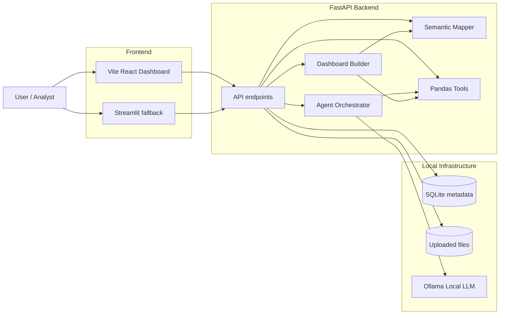

## 3. Trạng thái sản phẩm hiện tại

Project hiện tại là một **advanced prototype / pre-production foundation**, chưa phải production system hoàn chỉnh.

Đã có:

- Upload/read `csv`, `xls`, `xlsx`.
- FastAPI backend.
- React dashboard nhiều page.
- Streamlit fallback.
- SQLite metadata.
- Semantic mapper đa domain.
- Data dictionary upload/edit.
- Custom metric builder.
- Generic insight engine v2.
- Backend-driven dashboard.
- Ecommerce dashboard chuyên sâu.
- Generic analysis tools.
- Domain analysis tools cho retail, marketing, HR, finance/generic.
- Chart API trả Plotly figure JSON.
- Ollama local Copilot.
- Universal Planner Intent Schema cho Agent.
- Multi-step agent orchestration.
- SSE streaming cho chat progress.
- Tool result cache và semantic cache.
- Test suite tương đối rộng.

Chưa production-grade ở các phần:

- Chưa có auth/workspace/user ownership đầy đủ.
- Chưa có database schema governance/migration chuyên nghiệp như Alembic.
- Chưa có persistent chat history và agent run audit log đầy đủ.
- Chưa có job queue/background workers cho dataset lớn.
- Chưa có Redis cache/rate limit.
- Chưa có observability đầy đủ: metrics, tracing, error tracking.
- Chưa có evaluation suite 20-50 dataset thật.
- Chưa có role-based access control và data governance cho dữ liệu nhạy cảm.

## 4. Cấu trúc thư mục hiện tại

```text
.
├── app/
│   ├── main.py
│   ├── config.py
│   ├── database.py
│   ├── schemas/
│   │   └── models.py
│   ├── services/
│   │   ├── agent.py                         # legacy/simple agent wrapper
│   │   ├── agent_orchestrator.py            # AI Copilot orchestration
│   │   ├── cache_manager.py                 # in-memory TTL caches
│   │   ├── chart_generator.py               # Plotly chart specs
│   │   ├── code_interpreter.py              # controlled pandas code fallback
│   │   ├── dashboard_builder.py             # backend-driven dashboard
│   │   ├── dashboard_insight_engine.py      # insight cards
│   │   ├── data_cleaner.py                  # Amazon/ecommerce cleaning
│   │   ├── data_dictionary.py               # data dictionary parse/validate
│   │   ├── data_loader.py                   # csv/xls/xlsx loader
│   │   ├── dataset_pipeline.py              # ecommerce pipeline
│   │   ├── expression_engine.py             # safe custom metric expressions
│   │   ├── feature_engineering.py           # ecommerce features
│   │   ├── generic_insight_engine.py        # generic insight detectors v2
│   │   ├── intent_planner.py                # question -> structured analysis intent
│   │   ├── metric_builder.py                # custom metric validation/evaluation
│   │   ├── profiler.py                      # deterministic profiling
│   │   ├── report_generator.py              # markdown report
│   │   ├── semantic_cache.py                # semantic response cache
│   │   ├── semantic_mapper.py               # semantic roles/domain detection
│   │   ├── storage.py                       # dataset file + metadata access
│   │   └── llm/
│   │       └── ollama_provider.py
│   └── tools/
│       ├── domain_analysis_tools.py
│       ├── ecommerce_tools.py
│       ├── generic_analysis_tools.py
│       └── pandas_tool.py
├── data/
│   ├── raw/
│   ├── sample/
│   └── uploads/
├── docs/
├── frontend/
│   └── streamlit_app.py
├── tests/
├── web/
│   ├── src/
│   │   ├── App.tsx
│   │   ├── api.ts
│   │   ├── main.tsx
│   │   ├── styles.css
│   │   └── types.ts
│   ├── package.json
│   └── vite.config.ts
├── Dockerfile
├── docker-compose.yml
├── requirements.txt
└── README.md
```

Lưu ý:

- `web/node_modules`, `web/dist` và `__pycache__` là generated artifacts, không phải kiến trúc lõi.
- `app/services/agent.py` vẫn tồn tại cho legacy/simple flow, nhưng Copilot thật nằm ở `app/services/agent_orchestrator.py`.

## 5. Layered Architecture

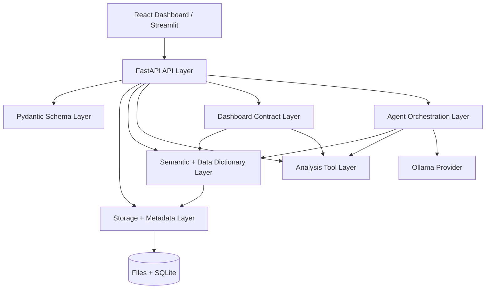

## 6. Backend Architecture

### 6.1 `app/main.py`

Vai trò:

- Khởi tạo FastAPI app.
- Cấu hình CORS.
- Cấu hình logging middleware.
- Optional API key.
- Upload dataset.
- Expose summary, report, chart.
- Expose semantic profile và data dictionary.
- Expose dashboard contract.
- Expose ecommerce endpoints.
- Expose AI Copilot endpoints.

Nhóm endpoint hiện tại:

```text
GET    /
GET    /health
POST   /upload
GET    /datasets
GET    /summary/{dataset_id}
POST   /chat
GET    /report/{dataset_id}

GET    /semantic-profile/{dataset_id}
PUT    /semantic-profile/{dataset_id}/overrides
DELETE /semantic-profile/{dataset_id}/overrides

POST   /datasets/{dataset_id}/data-dictionary
GET    /datasets/{dataset_id}/data-dictionary
PUT    /datasets/{dataset_id}/data-dictionary
DELETE /datasets/{dataset_id}/data-dictionary

GET    /datasets/{dataset_id}/metrics
POST   /datasets/{dataset_id}/metrics
PUT    /datasets/{dataset_id}/metrics/{metric_name}
DELETE /datasets/{dataset_id}/metrics/{metric_name}
POST   /datasets/{dataset_id}/metrics/{metric_name}/evaluate

GET    /dashboard/{dataset_id}
POST   /chart

POST   /agent/chat
POST   /agent/chat/stream
GET    /agent/status

GET    /ecommerce/overview/{dataset_id}
GET    /ecommerce/revenue-by-month/{dataset_id}
GET    /ecommerce/revenue-by-category/{dataset_id}
GET    /ecommerce/top-states/{dataset_id}
GET    /ecommerce/cancellation/{dataset_id}
GET    /ecommerce/top-skus/{dataset_id}
GET    /ecommerce/revenue-by-size/{dataset_id}
GET    /ecommerce/category-cancellation/{dataset_id}
GET    /ecommerce/fulfilment/{dataset_id}
GET    /ecommerce/courier/{dataset_id}
GET    /ecommerce/promotion/{dataset_id}
GET    /ecommerce/b2b/{dataset_id}
GET    /ecommerce/top-cities/{dataset_id}
GET    /ecommerce/state-cancellation/{dataset_id}
```

### 6.2 `app/schemas/models.py`

Vai trò:

- Định nghĩa contract giữa frontend và backend.
- Validate request body.
- Chuẩn hóa response shape.

Nhóm model chính:

- `ChatRequest`, `ChatResponse`
- `ChartRequest`
- `AgentChatRequest`, `AgentChatResponse`
- `ToolCallRecord`
- `ExecutionTimelineRecord`
- `ResultSummary`
- `QuickAction`
- `UploadResponse`
- `DatasetSummary`
- `SemanticOverrideRequest`
- `DataDictionaryField`
- `DataDictionary`
- `DataDictionaryResponse`

## 7. Data Loading và Storage Architecture

### 7.1 File loading

File:

```text
app/services/data_loader.py
```

Hỗ trợ:

- `.csv`
- `.xls`
- `.xlsx`

Excel uploads được parse thành dataframe, sau đó lưu nội bộ thành CSV trong `data/uploads`. Nhờ vậy `DatasetStore.load_dataframe()` không phải phân nhánh theo format gốc.

### 7.2 Dataset storage

File:

```text
app/services/storage.py
app/database.py
```

Storage hiện tại gồm:

- Uploaded dataframe files: `data/uploads/{dataset_id}.csv`.
- Metadata: SQLite qua SQLAlchemy.
- Semantic overrides: JSON field trong metadata.
- Data dictionary: JSON field trong metadata.
- Dataset signature: rows, columns, file mtime, semantic version.

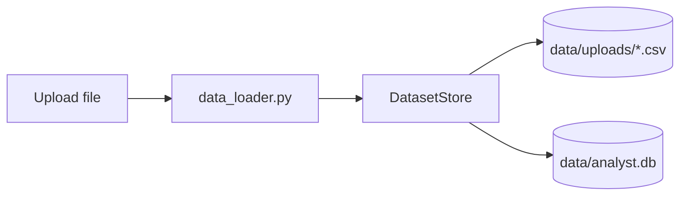

### 7.3 Metadata model

`DatasetMetadata` hiện giữ:

- `dataset_id`
- `filename`
- `path`
- `created_at`
- `semantic_version`
- `semantic_overrides_json`
- `data_dictionary_json`

`SemanticCache` hiện giữ semantic response cache cho AI Copilot.

## 8. Semantic Layer Architecture

File chính:

```text
app/services/semantic_mapper.py
```

Semantic mapper chịu trách nhiệm:

- Detect semantic roles.
- Detect domain.
- Tạo candidates cho từng role.
- Gán confidence.
- Sinh warnings nếu thiếu role quan trọng.
- Kết hợp auto detection, data dictionary và user override.

Các role tiêu biểu:

- `revenue`
- `cost`
- `profit`
- `margin`
- `discount`
- `date`
- `category`
- `segment`
- `quantity`
- `city`
- `state`
- `country`
- `customer`
- `campaign`
- `channel`
- `employee`
- `department`
- `job_role`
- `salary`
- `target`
- `conversion`
- `overtime`
- `tenure`
- `recency`
- `monetary`
- `frequency`

Các domain hiện hỗ trợ:

- `ecommerce`
- `retail`
- `marketing`
- `hr`
- `finance`
- `generic`

## 9. Semantic Priority Diagram

Sau Phase U1, priority mapping là:

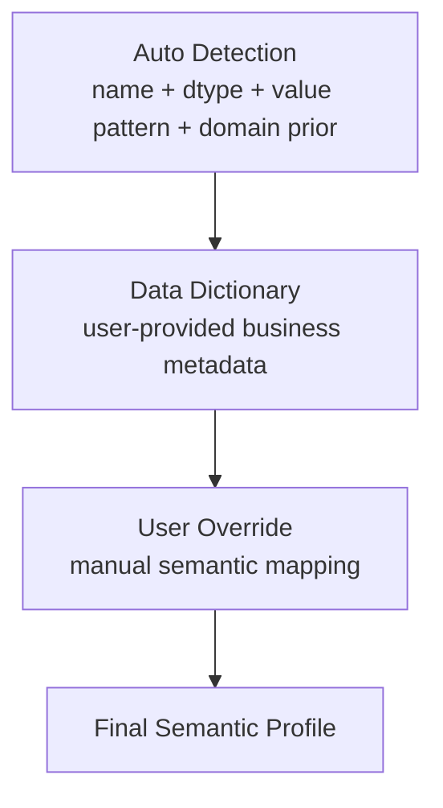

Ý nghĩa:

```text
auto detection < data dictionary < user override
```

Nếu user upload dictionary có `Sales -> revenue`, mapper sẽ ưu tiên dictionary hơn auto-detection.

Nếu user sau đó chỉnh trong Semantic Mapping Studio thành `Sales -> profit`, user override thắng dictionary.

## 10. Data Dictionary Architecture

File chính:

```text
app/services/data_dictionary.py
```

API:

```text
POST   /datasets/{dataset_id}/data-dictionary
GET    /datasets/{dataset_id}/data-dictionary
PUT    /datasets/{dataset_id}/data-dictionary
DELETE /datasets/{dataset_id}/data-dictionary
```

Format hỗ trợ:

- CSV.
- JSON.

Luồng:

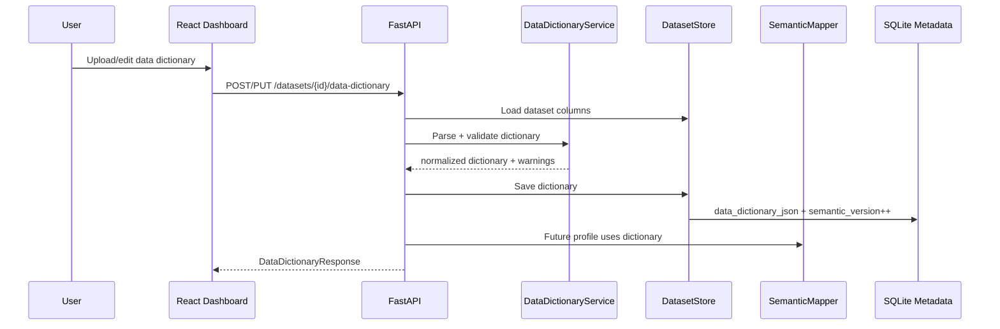

Data Dictionary giúp project hiểu các CSV có tên cột khó như:

```text
amt, dt, prod_grp, cust_seg
```

và map chúng thành:

```text
revenue, date, category, segment
```

## 11. Custom Metric Architecture

Files chính:

```text
app/services/expression_engine.py
app/services/metric_builder.py
```

API:

```text
GET    /datasets/{dataset_id}/metrics
POST   /datasets/{dataset_id}/metrics
PUT    /datasets/{dataset_id}/metrics/{metric_name}
DELETE /datasets/{dataset_id}/metrics/{metric_name}
POST   /datasets/{dataset_id}/metrics/{metric_name}/evaluate
```

Metric definition:

```json
{
  "name": "margin",
  "label": "Margin",
  "expression": "profit / revenue",
  "format": "percent",
  "aggregation": "mean",
  "required_roles": ["profit", "revenue"],
  "higher_is_better": true
}
```

Expression engine dùng Python AST allowlist, không dùng `eval` trực tiếp.

Cho phép:

- role/column names
- numeric constants
- `+`, `-`, `*`, `/`
- `sum`, `mean`, `count`, `safe_div`

Chặn:

- import
- attribute access
- arbitrary function call
- file/network/system calls

Dashboard và Agent có thể dùng custom metric:

```text
metric definition
  -> safe expression evaluation
  -> dashboard KPI/table/chart/insight
  -> agent tools evaluate_custom_metric/custom_metric_breakdown
```

## 12. Analysis Tool Architecture

### 11.1 Ecommerce tools

File:

```text
app/tools/ecommerce_tools.py
```

Các tool chính:

- `get_sales_overview`
- `get_data_quality_summary`
- `revenue_by_month`
- `revenue_by_category`
- `top_states_by_revenue`
- `top_skus_by_revenue`
- `revenue_by_size`
- `category_cancellation_summary`
- `fulfilment_summary`
- `courier_summary`
- `promotion_summary`
- `b2b_summary`
- `top_cities_by_revenue`
- `state_cancellation_summary`
- `cancellation_summary`

Các tool ecommerce giả định dataframe đã qua:

```text
clean_amazon_sales_data
  -> add_amazon_sales_features
```

Pipeline nằm ở:

```text
app/services/dataset_pipeline.py
```

### 11.2 Generic analysis tools

File:

```text
app/tools/generic_analysis_tools.py
```

Nhóm tool:

- Dataset overview.
- Missing values.
- Duplicate rows.
- Groupby aggregate.
- Correlation.
- Semantic overview/KPIs/time series/breakdown/target summary.
- Segment comparison.
- Outlier detection.
- Trend analysis.
- Period-over-period change.
- Pareto analysis.
- Cohort summary.
- Anomaly detection.
- Simple forecast.
- Metric change explanation.

### 11.3 Domain analysis tools

File:

```text
app/tools/domain_analysis_tools.py
```

Retail:

- Margin summary.
- Loss analysis.
- Discount effect.
- Segment/state/category interaction.
- Top opportunities.

Marketing:

- Response by segment/country/channel.
- Campaign acceptance.
- RFM-like summary.
- Income band response.
- Purchase channel summary.

HR:

- Attrition by overtime/department/job role.
- Income band attrition.
- Tenure risk.
- High-risk segments.

Generic:

- Numeric distributions.
- Top categorical values.

## 13. Dashboard Architecture

File:

```text
app/services/dashboard_builder.py
app/services/dashboard_insight_engine.py
```

Endpoint:

```text
GET /dashboard/{dataset_id}
```

Dashboard là **backend-driven**. Frontend không tự quyết định toàn bộ business logic, mà render contract từ backend.

Contract chính:

```json
{
  "contract_version": 2,
  "dataset_id": "...",
  "domain": "retail",
  "semantic_profile": {},
  "kpi_cards": [],
  "insight_cards": [],
  "charts": [],
  "tables": [],
  "warnings": []
}
```

Luồng:

```mermaid
flowchart TB
    Request[GET /dashboard/{dataset_id}]
    Load[Load dataframe]
    Profile[Build semantic profile]
    Domain[Detect domain]
    Tools[Run domain/generic tools]
    Insights[Build insight cards]
    Contract[Dashboard contract v2]
    React[React renders cards/charts/tables]

    Request --> Load
    Load --> Profile
    Profile --> Domain
    Domain --> Tools
    Tools --> Insights
    Insights --> Contract
    Contract --> React
```

Dashboard behavior theo domain:

- `ecommerce`: dùng ecommerce tools.
- `retail`: revenue, profit, quantity, margin, category/state/segment, trend.
- `marketing`: response, campaign acceptance, RFM-like, channel purchase.
- `hr`: employee count, attrition, income, department/job role/overtime.
- `finance`: revenue/cost/profit/margin nếu đủ role.
- `generic`: rows, columns, missing, duplicates, numeric/categorical summaries.

Insight card không chỉ là chart caption. Nó có:

- `finding`
- `evidence`
- `why_it_matters`
- `recommended_next_question`
- `tone`
- `severity`
- `confidence`

Generic Insight Engine v2:

```text
app/services/generic_insight_engine.py
```

Bổ sung các detector không phụ thuộc domain:

- data quality
- top contributor
- trend
- outlier
- segment difference
- correlation
- pareto concentration
- target/conversion

Dashboard dùng engine này cho generic/finance dashboard và bổ sung vào domain dashboards khi insight chuyên biệt còn ít.

## 14. Chart Architecture

File:

```text
app/services/chart_generator.py
```

Endpoint:

```text
POST /chart
```

Chart types:

- `bar`
- `line`
- `scatter`
- `histogram`
- `box`

Backend validate column trước khi tạo Plotly figure JSON.

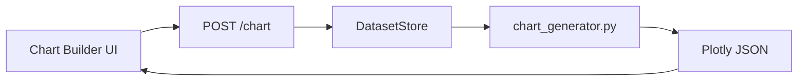

## 15. AI Copilot Architecture

File chính:

```text
app/services/agent_orchestrator.py
app/services/intent_planner.py
app/services/llm/ollama_provider.py
```

Endpoints:

```text
POST /agent/chat
POST /agent/chat/stream
GET  /agent/status
```

Copilot flow:

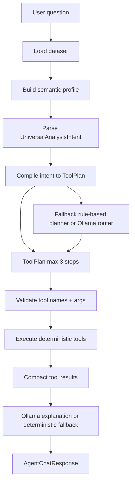

Quan trọng:

- LLM không nhận full CSV.
- LLM không được tự tính số liệu.
- Backend reject tool name lạ.
- Backend validate args và cột.
- Tool result đầy đủ được trả về response, nhưng context gửi LLM được compact.
- Nếu Ollama lỗi hoặc timeout, backend trả deterministic fallback.
- Agent parse intent trước khi fallback sang rule/LLM router.

Response hiện có:

- `answer`
- `tool_call`
- `tool_calls`
- `agent_plan`
- `agent_plan.intent`
- `data`
- `chart`
- `warnings`
- `execution_timeline`
- `result_summary`
- `quick_actions`
- `latency`
- `cache`
- `explanation_source`

## 16. Streaming Copilot Flow

Endpoint:

```text
POST /agent/chat/stream
```

Trả `text/event-stream`.

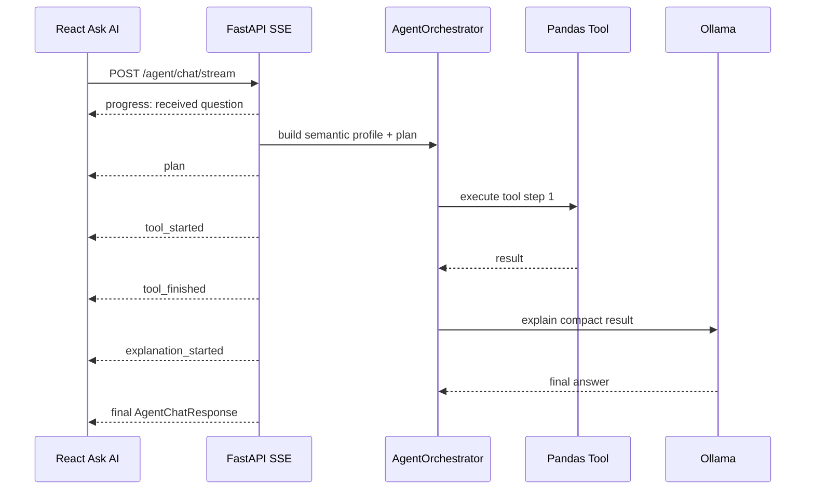

Frontend fallback:

- Nếu stream lỗi, gọi lại `POST /agent/chat`.
- Nếu Ollama lỗi, vẫn hiện deterministic fallback answer.

## 17. Cache Architecture

File:

```text
app/services/cache_manager.py
app/services/semantic_cache.py
```

Cache hiện có:

- `semantic_profile_cache`: TTL runtime.
- `dashboard_cache`: TTL runtime.
- `tool_result_cache`: TTL runtime.
- `SemanticCache` trong SQLite cho semantic question/response cache.

Cache key có thể gồm:

- `dataset_id`
- dataset signature
- `semantic_version`
- semantic overrides
- data dictionary
- tool name
- normalized args

Invalidation:

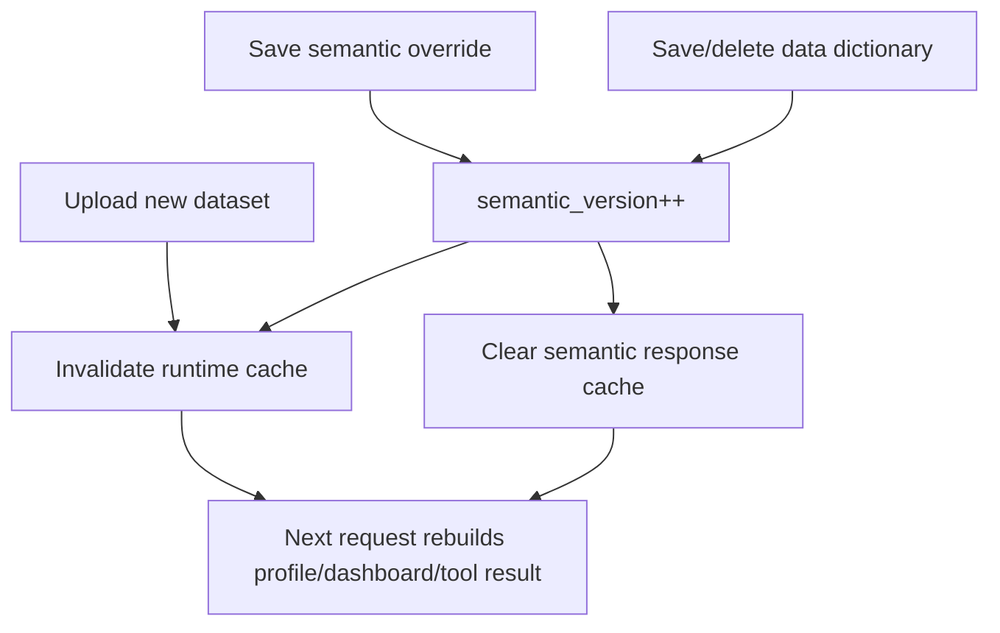

## 18. Frontend Architecture

Primary frontend:

```text
web/
```

Stack:

- Vite.
- React.
- TypeScript.
- Tailwind CSS.
- lucide-react.
- Plotly React wrapper.

Core files:

- `web/src/App.tsx`: main app layout and pages.
- `web/src/api.ts`: backend API client.
- `web/src/types.ts`: shared frontend types.
- `web/src/styles.css`: global styling.

Main sections:

- Upload.
- Dashboard.
- Overview.
- Data Quality.
- Ecommerce.
- Charts.
- Ask AI.
- Report.
- Semantic Mapping Studio.
- Data Dictionary panel.
- Metric Builder panel.

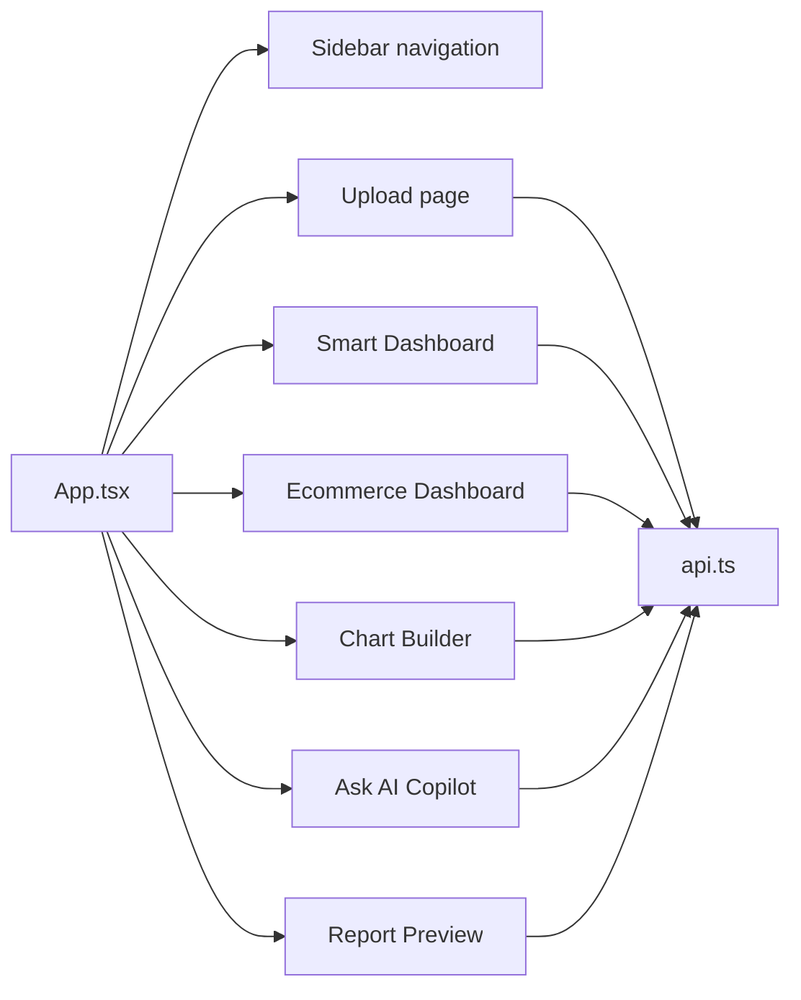

Fallback frontend:

```text
frontend/streamlit_app.py
```

Streamlit vẫn hữu ích để demo nhanh hoặc fallback, nhưng React là UI chính.

## 19. API Architecture Summary

### 19.1 Dataset APIs

```text
POST /upload
GET  /datasets
GET  /summary/{dataset_id}
GET  /report/{dataset_id}
```

### 19.2 Semantic APIs

```text
GET    /semantic-profile/{dataset_id}
PUT    /semantic-profile/{dataset_id}/overrides
DELETE /semantic-profile/{dataset_id}/overrides
```

### 19.3 Data Dictionary APIs

```text
POST   /datasets/{dataset_id}/data-dictionary
GET    /datasets/{dataset_id}/data-dictionary
PUT    /datasets/{dataset_id}/data-dictionary
DELETE /datasets/{dataset_id}/data-dictionary
```

### 19.4 Custom Metric APIs

```text
GET    /datasets/{dataset_id}/metrics
POST   /datasets/{dataset_id}/metrics
PUT    /datasets/{dataset_id}/metrics/{metric_name}
DELETE /datasets/{dataset_id}/metrics/{metric_name}
POST   /datasets/{dataset_id}/metrics/{metric_name}/evaluate
```

### 19.5 Dashboard and chart APIs

```text
GET  /dashboard/{dataset_id}
POST /chart
```

### 19.6 Agent APIs

```text
POST /agent/chat
POST /agent/chat/stream
GET  /agent/status
```

### 19.7 Ecommerce APIs

```text
GET /ecommerce/overview/{dataset_id}
GET /ecommerce/revenue-by-month/{dataset_id}
GET /ecommerce/revenue-by-category/{dataset_id}
GET /ecommerce/top-states/{dataset_id}
GET /ecommerce/cancellation/{dataset_id}
GET /ecommerce/top-skus/{dataset_id}
GET /ecommerce/revenue-by-size/{dataset_id}
GET /ecommerce/category-cancellation/{dataset_id}
GET /ecommerce/fulfilment/{dataset_id}
GET /ecommerce/courier/{dataset_id}
GET /ecommerce/promotion/{dataset_id}
GET /ecommerce/b2b/{dataset_id}
GET /ecommerce/top-cities/{dataset_id}
GET /ecommerce/state-cancellation/{dataset_id}
```

## 20. Deployment Architecture

Local development:

```text
Backend:   uvicorn app.main:app --reload
React:     cd web && npm run dev
Streamlit: streamlit run frontend/streamlit_app.py
Ollama:    ollama serve
```

Docker Compose:

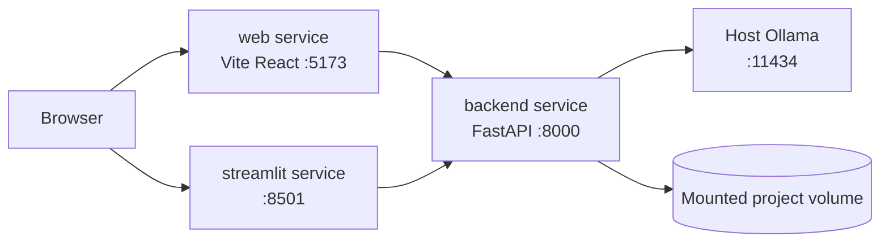

`docker-compose.yml` hiện có:

- `backend`
- `web`
- `streamlit`

Ollama chạy trên host qua `host.docker.internal`.

## 21. Configuration Architecture

File:

```text
app/config.py
```

Settings đọc từ `.env` hoặc environment variables.

Các nhóm config:

- App: `APP_NAME`, `APP_VERSION`, `DEBUG`.
- CORS: `ALLOWED_ORIGINS`.
- Upload: `MAX_UPLOAD_BYTES`, `UPLOAD_DIR`.
- Ollama: `OLLAMA_BASE_URL`, `OLLAMA_MODEL`, `OLLAMA_ROUTER_MODEL`.
- Timeout: `OLLAMA_ROUTER_TIMEOUT`, `OLLAMA_EXPLAIN_TIMEOUT`.
- Code interpreter: `CODE_INTERPRETER_TIMEOUT`, `CODE_INTERPRETER_MAX_ROWS`.
- Database: `DATABASE_URL`.
- Optional API key: `API_KEY`.
- Logging: `LOG_LEVEL`.

## 22. Testing Architecture

Test suite hiện có trong:

```text
tests/
```

Nhóm test chính:

- Profiler.
- Data loader.
- Data cleaner.
- Feature engineering.
- Ecommerce tools.
- Generic tools.
- Chart generator.
- Dashboard builder.
- Semantic mapper.
- Data dictionary service/API.
- Agent orchestrator.
- Code interpreter.
- Main API.

Lệnh chạy:

```bash
PYTHONPATH=. pytest -q
```

Frontend build check:

```bash
cd web
npm run build
```

## 23. Error Handling và Guardrails

Hiện có:

- FastAPI exception handler.
- Structured logging middleware.
- Upload size limit.
- Unsupported file extension handling.
- Chart column validation.
- Tool column validation.
- Data dictionary column validation.
- Unknown LLM tool rejection.
- Deterministic fallback nếu Ollama lỗi.
- JSON-safe conversion cho tool outputs.

Vẫn cần cải thiện:

- Chuẩn hóa error response toàn hệ thống.
- Request ID xuyên suốt frontend/backend/agent.
- Agent run persistence.
- Observability dashboard.
- Alerting.

## 24. Production Readiness Gap

Hiện project chưa nên gọi là production-ready. Nó đang ở mức:

```text
Strong portfolio prototype / pre-production AI data product foundation.
```

Để lên production, cần thêm:

- Authentication và authorization.
- Workspace/user/dataset ownership.
- Database migration bằng Alembic.
- Persistent dashboard/report/chat history.
- Background jobs cho dataset lớn.
- Redis hoặc cache service ngoài process.
- Rate limit.
- Audit log cho semantic override/data dictionary.
- PII/sensitive data controls.
- Monitoring, tracing, metrics.
- Evaluation suite nhiều dataset thật.
- CI/CD.
- Deployment hardening.

## 25. Roadmap Kiến Trúc Tiếp Theo

Ưu tiên gần:

1. **Metric Builder UI**
   - Tạo/sửa/xóa custom metric trực tiếp trong React.
   - Preview metric trước khi save.
   - Gợi ý role/column từ semantic profile và data dictionary.

2. **Generic Insight Engine Evaluation**
   - Đánh giá chất lượng insight v2 trên nhiều dataset.
   - Giảm insight nhiễu và tăng confidence calibration.

3. **Intent Planner v2**
   - Parse filters và date ranges tốt hơn.
   - Thêm LLM intent parser fallback có backend validation.
   - Hiển thị intent debug trong Ask AI UI.

4. **U5 - Evaluation Suite**
   - Test 20-50 CSV đa domain.
   - Đo semantic mapping accuracy, dashboard coverage, answer correctness.

5. **Production hardening**
   - Auth, workspace, DB migration, Redis, observability, audit log.

LangGraph chỉ nên đưa vào khi:

- Tool layer đã đủ phong phú.
- Semantic layer đã ổn.
- Multi-step planner hiện tại bắt đầu khó maintain.
- Cần workflow dài hơn với branching, retry, reflection hoặc multi-agent roles.

## 26. Kết luận

Kiến trúc hiện tại đã vượt xa starter ban đầu. Project bây giờ là một nền tảng AI data analyst có:

- Deterministic analytics.
- Domain-aware dashboards.
- Semantic layer.
- Data dictionary.
- Agent orchestration.
- Local LLM integration.
- React product UI.

Điểm mạnh nhất của kiến trúc là tách rõ:

```text
Tính toán số liệu bằng tools kiểm soát được.
Giải thích/ngôn ngữ tự nhiên bằng LLM.
Semantic meaning bằng mapper + dictionary + override.
Dashboard rendering bằng contract từ backend.
```

Đây là hướng đúng nếu muốn phát triển thành một AI analytics product nghiêm túc.
