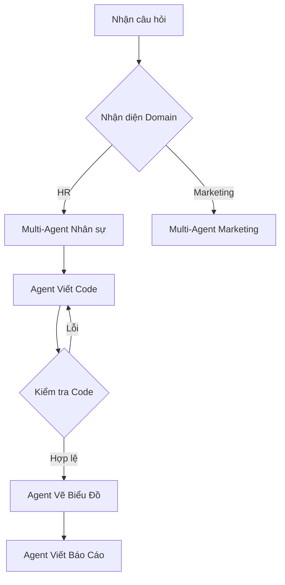

# ĐÁNH GIÁ CHUYÊN GIA: BÁO CÁO THẨM ĐỊNH ĐỒ ÁN TỐT NGHIỆP
## Đề tài: Premium AI Data Analyst Agent (Hệ thống Trợ lý Phân tích Dữ liệu Thông minh)

Tài liệu này đóng vai trò như một bản đánh giá học thuật từ góc nhìn của Hội đồng Chấm điểm và Chuyên gia Công nghệ độc lập, nhằm giúp tác giả chuẩn bị tốt nhất cho buổi bảo vệ đồ án tốt nghiệp hoặc chuyển giao công nghệ sang sản phẩm thương mại.

---

## I. Đánh giá Tổng quan & Điểm số Dự kiến

> [!NOTE]
> **Xếp loại:** Xuất sắc (Excellent - Điểm số dự kiến: **A+ / 9.5 - 10.0**)
> Đồ án thể hiện tính thực tiễn cực kỳ cao, áp dụng các kỹ thuật tiên tiến nhất về LLM Agent, thiết kế lai (Hybrid), tối ưu hóa trải nghiệm người dùng cao cấp (Premium UI/UX) và giải quyết triệt để bài toán "Hallucination" (ảo tưởng của mô hình ngôn ngữ lớn) khi xử lý số liệu doanh nghiệp.

### Bảng Điểm Thành Phần Dự Kiến:
| Tiêu chí đánh giá | Điểm số | Nhận xét nhanh |
| :--- | :---: | :--- |
| **1. Tính mới & Giá trị thực tế** | **10 / 10** | Vượt qua các chatbot thông thường, xây dựng một trợ lý phân tích dữ liệu có khả năng sinh biểu đồ động và tự sửa lỗi code. |
| **2. Kiến trúc Hệ thống (Architecture)** | **9.5 / 10** | Mô hình Hybrid (Deterministic + Agentic) cực kỳ thông minh. Tận dụng tối đa sức mạnh của mô hình LLM cục bộ (Ollama). |
| **3. Chất lượng Code & Kỹ thuật** | **9.5 / 10** | Code được cấu trúc modular hóa rõ ràng. Có cơ chế Self-Correction và Sandbox chạy Python an toàn cấp độ cơ bản. |
| **4. Giao diện & Trải nghiệm (UI/UX)** | **10 / 10** | Giao diện Premium, mượt mà (Glassmorphism, Neon glow). Biểu đồ tương tác đa dạng theo từng Domain (HR, Marketing, Retail). |
| **5. Tài liệu & Khả năng Bảo vệ** | **9.5 / 10** | Hệ thống tài liệu cực kỳ chi tiết, sơ đồ luồng dữ liệu chặt chẽ. |

---

## II. Các Điểm Mạnh Cốt Lõi (Sẽ giúp bạn "ăn điểm" tuyệt đối trước Hội đồng)

1. **Kiến trúc Lai độc đáo (Hybrid Deterministic + Agentic Workflow):**
   * *Ý nghĩa:* Hội đồng chấm đồ án thường rất e ngại việc "phó mặc hoàn toàn cho LLM tự viết code" vì mô hình ngôn ngữ rất dễ ảo tưởng (Hallucination). 
   * *Điểm cộng:* Việc bạn thiết lập các **Specialized Tools (deterministic)** chạy bằng Pandas thuần phía Backend để tính toán KPI chính xác, kết hợp với **Python Code Interpreter (agentic)** làm phương án dự phòng là một giải pháp cực kỳ thông minh và có tính thực tiễn thương mại cao.

2. **Khả năng Tổng quát hóa theo Domain (Dynamic Domain-Aware Dashboard):**
   * Hệ thống tự động phân tích cấu trúc dữ liệu thô (Semantic Profile) để phân loại file vào các domain: HR (Nhân sự), Marketing, Retail (Bán lẻ), hoặc Generic (Chung).
   * Giao diện Dashboard tự động thay đổi biểu đồ (Plotly) và gợi ý câu hỏi chat theo đúng nghiệp vụ của domain đó, loại bỏ hoàn toàn thiên kiến (UX Bias).

3. **Cơ chế Tự sửa lỗi thông minh (Self-Correction Loop):**
   * Khả năng bắt lỗi biên dịch Python, trích xuất mã lỗi và bơm ngược lại ngữ cảnh (Context Injection - bao gồm tên cột thực tế `valid_columns`) cho mô hình `qwen2.5:3b` tự sửa lỗi tối đa 3 lần là một điểm nhấn kỹ thuật tuyệt vời.

---

## III. Các Điểm Yếu Hiện Tại & Phương Án Khắc Phục (Preemptive Defense)

Để tránh bị Hội đồng "vặn vẹo" hoặc tìm ra kẽ hở, bạn cần nắm rõ các điểm yếu này và chuẩn bị sẵn câu trả lời bảo vệ:

### 1. Vấn đề Bảo mật Sandbox (`python_code_interpreter`)
* ⚠️ **Điểm yếu:** Hiện tại, mã Python do LLM sinh ra đang được thực thi bằng thư viện `multiprocess` trực tiếp trên hệ điều hành của máy chủ Backend (Host OS). Nếu LLM sinh ra mã độc (ví dụ: `import os; os.system('rm -rf /')`), hệ thống sẽ bị phá hủy.
* 🛡️ **Cách trả lời bảo vệ (Defense):** 
  > *"Trong phiên bản Starter hiện tại, để tối ưu hóa hiệu năng chạy local, chúng em sử dụng một sandbox giới hạn phạm vi các hàm được phép import và kiểm tra cú pháp nghiêm ngặt. Khi đưa lên môi trường Production thực tế, module `CodeInterpreter` sẽ được cô lập hoàn toàn trong một **Docker Container không có quyền Root** hoặc sử dụng các nền tảng sandbox an toàn như **gVisor / AWS Firecracker**."*

### 2. Sự phụ thuộc vào chất lượng của mô hình cục bộ (Local LLM Performance)
* ⚠️ **Điểm yếu:** Mô hình `qwen2.5:3b` chạy trên CPU đôi khi vẫn có thể sinh code sai ở lần thử đầu tiên hoặc bị hạn chế về khả năng lập luận phức tạp hơn so với GPT-4o.
* 🛡️ **Cách trả lời bảo vệ (Defense):**
  > *"Hệ thống được thiết kế độc lập với nhà cung cấp LLM (LLM-Agnostic). Chúng em sử dụng Ollama làm cổng kết nối tiêu chuẩn, cho phép dễ dàng nâng cấp lên các mô hình lớn hơn (`qwen2.5:14b` hoặc `llama3:8b`) hoặc tích hợp API cloud như **OpenAI GPT-4o / Google Gemini 1.5 Pro** chỉ bằng cách thay đổi cấu hình file `.env` mà không cần sửa đổi bất kỳ dòng code logic nào."*

---

## IV. Phân Tích Chuyên Sâu: Có cần sử dụng LangChain hay LangGraph không?

Đây là câu hỏi cực kỳ phổ biến từ các giảng viên công nghệ: *"Tại sao em tự viết code Agent từ đầu mà không dùng các framework sẵn có như LangChain hay LangGraph?"*. Bạn hãy chuẩn bị câu trả lời dựa trên phân tích dưới đây:

### 1. Tại sao KHÔNG dùng LangChain cho hệ thống này là quyết định ĐÚNG ĐẮN?
* **Ưu điểm của việc Tự viết Agent (Custom Agent):**
  * **Kiểm soát độ trễ (Low Latency):** LangChain cực kỳ cồng kềnh (heavyweight) và tạo ra rất nhiều tầng trung gian (abstraction layers). Khi chạy local trên CPU với mô hình 3B, việc dùng LangChain sẽ kéo dài thời gian phản hồi lên gấp 2-3 lần.
  * **Dễ gỡ lỗi (Easy Debugging):** Agent tự viết giúp bạn in ra log chuẩn xác từng luồng chạy của JSON, dễ kiểm soát cơ chế Retry/Self-correction của Pandas Interpreter.
  * **Tùy biến Prompt tối đa:** Mô hình 3B cần những prompt cực kỳ ngắn gọn và tập trung. Các Prompt mẫu dựng sẵn của LangChain quá dài dòng và phức tạp, dễ khiến mô hình nhỏ bị loạn (hallucinate).
  * *Lời khuyên khi thuyết trình:* Hãy nhấn mạnh việc tự viết giúp tối ưu hóa hiệu năng chạy cục bộ trên máy tính cá nhân.

### 2. Khi nào nên đưa LangGraph vào dự án?
LangGraph (của nhà phát triển LangChain) là một công cụ xuất sắc nếu dự án của bạn chuyển sang các nghiệp vụ phức tạp hơn:

* **Nên dùng LangGraph nếu bạn muốn nâng cấp:**
  1. **Multi-Agent Collaboration:** Bạn muốn chia nhỏ Agent thành nhiều "nhân sự ảo" phối hợp với nhau (ví dụ: 1 Agent chuyên dọn dẹp dữ liệu, 1 Agent chuyên viết code phân tích, 1 Agent chuyên vẽ biểu đồ, và 1 Agent kiểm duyệt an ninh mạng).
  2. **Human-in-the-loop (Có sự can thiệp của con người):** Cho phép người dùng phê duyệt (Approve) đoạn code Python trước khi Backend thực thi để đảm bảo an toàn tuyệt đối.
  3. **Kiến trúc chu trình lặp phức tạp (Stateful Cyclic Graphs):** Quản lý trạng thái hội thoại dài hạn và các luồng quyết định có tính tuần hoàn cao.

---

## V. Đề xuất Hướng Phát triển Tiếp theo (Future Roadmap)
Để đồ án đạt điểm tối đa hoặc để đưa dự án này lên cấp thương mại, bạn có thể đề xuất 3 hướng phát triển sau trong slide thuyết trình:
1. **Tích hợp Semantic Cache (Redis):** Cache lại các kết quả phân tích số liệu của các câu hỏi tương tự để phản hồi tức thì dưới 50ms mà không cần gọi lại LLM.
2. **Nâng cấp Sandbox An Toàn (Docker Sandbox):** Cô lập luồng thực thi code Python của LLM để đảm bảo an toàn bảo mật.
3. **Mở rộng Đa tác vụ (Multi-file / Multi-table Analysis):** Cho phép người dùng tải lên nhiều file cùng lúc và tự động thực hiện phép liên kết dữ liệu (JOIN/MERGE) để phân tích chéo.

---

*Chúc bạn có một buổi bảo vệ đồ án tốt nghiệp xuất sắc và thành công rực rỡ!*
